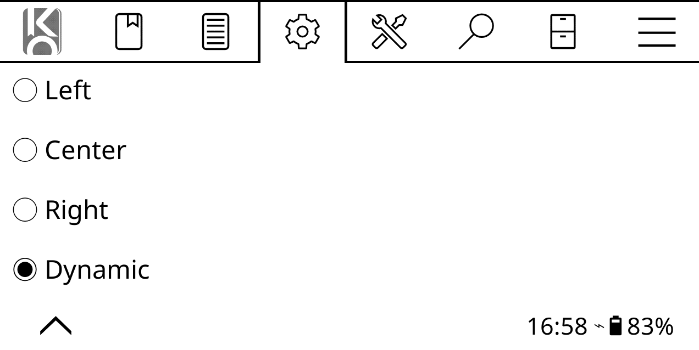
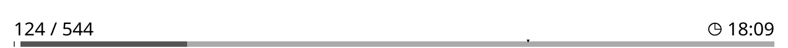
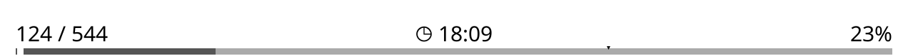
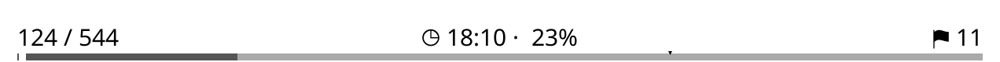
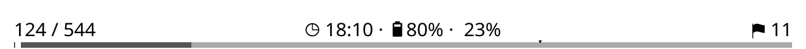

# KOReader.patches

Personal userpatches for KOReader. 

## Install

Copy `.lua` files into `koreader/patches/` and restart KOReader. See the upstream [user-patches guide](https://github.com/koreader/koreader/wiki/User-patches).

## 2-footer-zones.lua

Adds Dynamic alignment to Status bar → Configure items → Alignment.

Dynamic spreads enabled items across left, center, and right zones:
1 item is centered, 2 items are split left/right, and 3+ items are distributed evenly,
with any leftover items placed in the center.

<code>n = 1</code> (same as center)

<code>n = 2</code>

<code>n = 3</code>

<code>n = 4</code>

<code>n = 5</code>

<code>n = 6</code>

> [!NOTE]
> Progress bar must be above/below items (not alongside).

Min KOReader: `v2025.04-52`. Tested on `v2025.10-81-g4186cde33_2026-01-06`.

## License

[GPL-3.0](LICENSE).
